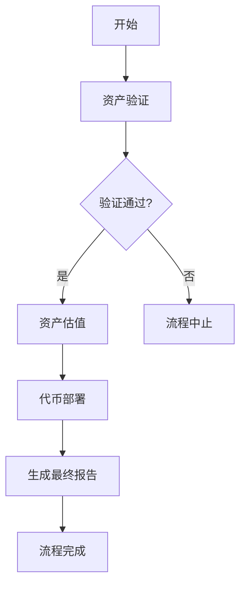

# RWA 资产代币化工作流

基于 Agno Workflows 2.0 实现的完整 RWA（Real World Assets）资产代币化流程。

## 📋 功能概述

该工作流包含三个核心代理，实现完整的资产代币化流程：

1. **Asset Verification Agent** - 资产验证代理
   - 验证用户上传的资产文件（房产证等）
   - 检查文档真实性和合法性
   - 生成验证报告并记录资产关键信息

2. **Asset Valuation Agent** - 资产估值代理
   - 获取用户输入的资产信息（类型、地区、面积、年限等）
   - 结合验证代理提供的关键信息
   - 通过查询市场情况对资产进行专业估值

3. **On-chain Notarization Agent** - 链上公证代理
   - 获取用户输入的代币信息（名称、符号、供应量等）
   - 在以太坊测试网 Sepolia 上部署 ERC20 代币合约
   - 记录代币信息并生成部署报告

## 🔄 工作流程



### 详细步骤

1. **资产验证阶段**
   - 用户上传资产文件或图片
   - 系统验证文件真实性和合法性
   - 如验证通过，要求用户输入详细资产信息
   - 如验证不通过，中止流程并输出验证报告

2. **资产估值阶段**
   - 用户提供资产详细信息
   - 系统进行市场调研和价值评估
   - 生成专业估值报告

3. **代币部署阶段**
   - 用户提供代币参数（名称、符号、供应量等）
   - 系统在以太坊 Sepolia 测试网部署 ERC20 合约
   - 记录合约地址和交易信息

4. **报告生成**
   - 汇总所有代理生成的报告
   - 输出完整的 RWA 代币化报告

## 🚀 使用方法

### 1. 直接运行测试

```bash
python rwa_workflow.py
```

### 2. 在代码中使用

```python
from rwa_workflow import run_rwa_workflow, print_rwa_workflow

# 运行工作流
response = run_rwa_workflow("我要代币化我的房产...")

# 打印响应
print_rwa_workflow("我要代币化我的房产...")
```

### 3. 在 Streamlit 中集成

```python
import streamlit as st
from rwa_workflow import rwa_workflow

st.title("RWA 资产代币化平台")

user_input = st.text_area("请描述您的资产和代币化需求：")

if st.button("开始 RWA 流程"):
    with st.spinner("处理中..."):
        response = rwa_workflow.run(message=user_input)
        st.success("流程完成！")
        st.write(response.content)
```

## 📝 输入格式示例

```
我要将我的房产进行代币化。我已经准备好了房产证照片，
房产信息如下：
- 资产类型：住宅房产
- 位置：北京市朝阳区
- 面积：120平米
- 房龄：5年

代币信息：
- 代币名称：Beijing Property Token
- 代币符号：BPT
- 供应量：1000000
```

## ⚙️ 技术特点

- **基于 Agno Workflows 2.0**：使用最新的工作流框架
- **条件判断**：智能流程控制，根据验证结果决定后续步骤
- **错误处理**：完整的异常处理和状态管理
- **可扩展性**：模块化设计，易于添加新的代理和功能
- **状态持久化**：使用 SQLite 存储会话和内存数据

## 📁 文件结构

```
agents/
├── rwa_workflow.py              # 主工作流文件
├── asset_verification_agent.py # 资产验证代理
├── asset_valuation_agent.py    # 资产估值代理
├── onchain_notarization_agent.py # 链上公证代理
└── rwa_team.py                 # RWA 团队（可选）
```

## 🔧 配置要求

1. **环境变量**：
   - `AZURE_OPENAI_API_KEY`
   - `AZURE_OPENAI_ENDPOINT`
   - 其他相关 API 密钥

2. **依赖库**：
   - `agno`
   - `openai`
   - `sqlite3`
   - 其他相关依赖

## 💡 最佳实践

1. **资产文件**：确保上传清晰、完整的资产证明文件
2. **信息准确性**：提供准确的资产信息以获得精确估值
3. **代币参数**：合理设计代币经济模型
4. **测试环境**：建议先在测试网环境验证流程

## 🐛 故障排除

如果遇到问题，请检查：
1. 环境变量配置是否正确
2. 网络连接是否正常
3. API 服务是否可用
4. 输入格式是否符合要求

## 📞 支持

如需帮助或有问题，请查看日志输出或联系技术支持。